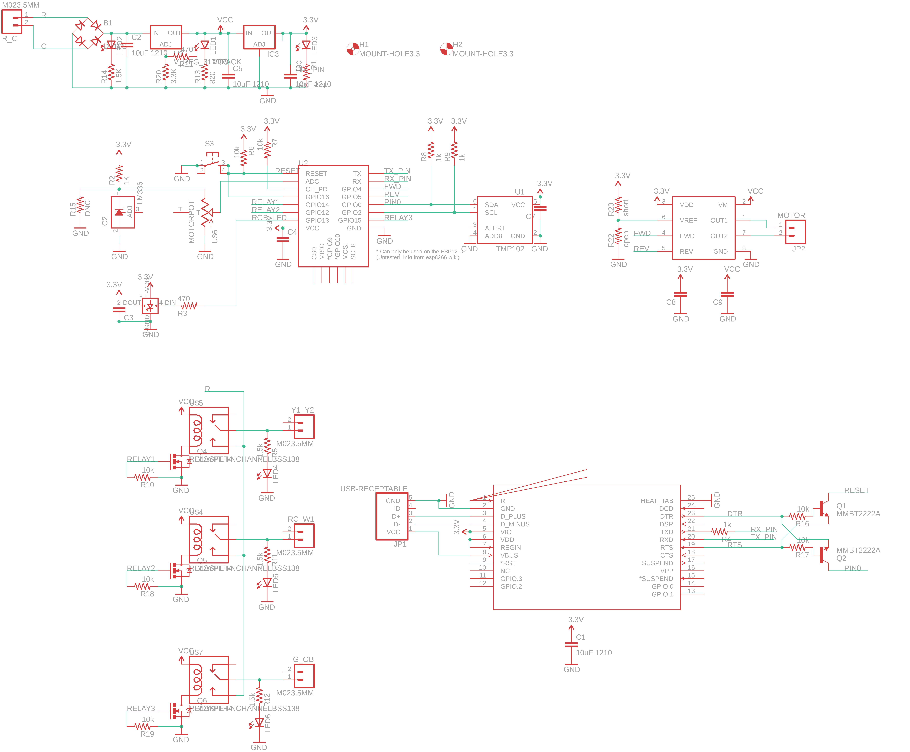
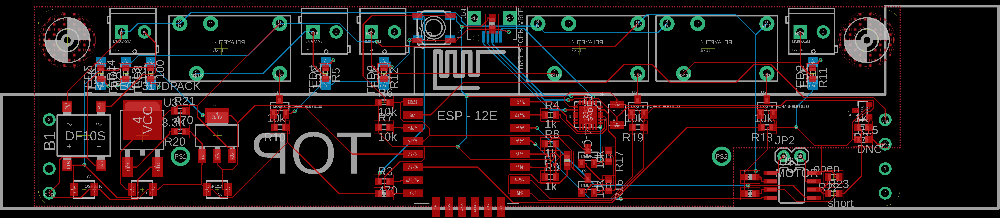

# therma
A Wifi-enabled Thermostat

I saw a motorized linear potentiometer on Sparkfun and had to get it. After watching something about Google's Nook, I wanted to see if I could design a Wifi enabled thermostat with a more classic left to right temperature-setting design.

The motorized functionality was used to add scheduling that moved the slider when the set temperature changes based on the schedule programmed.

